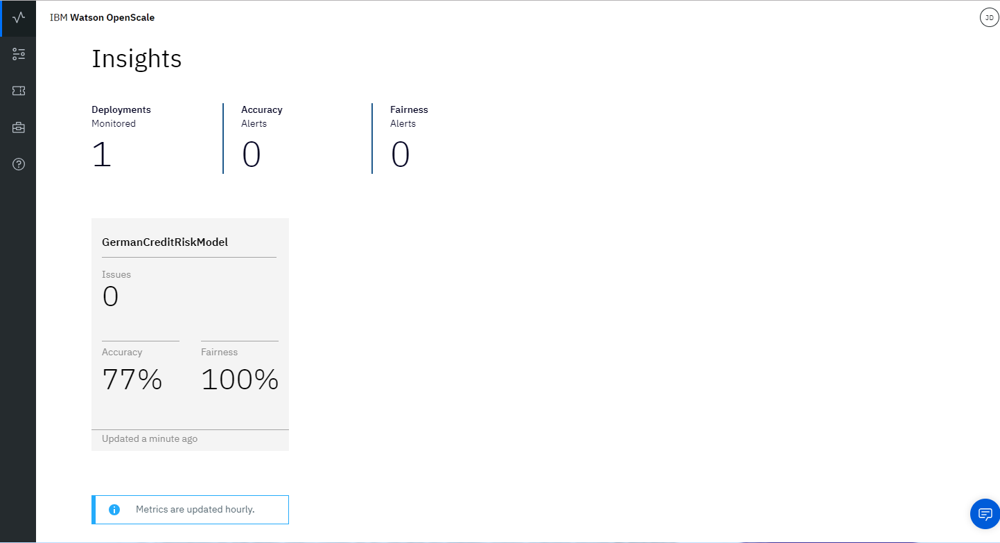
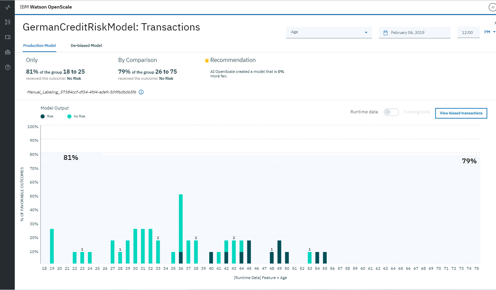
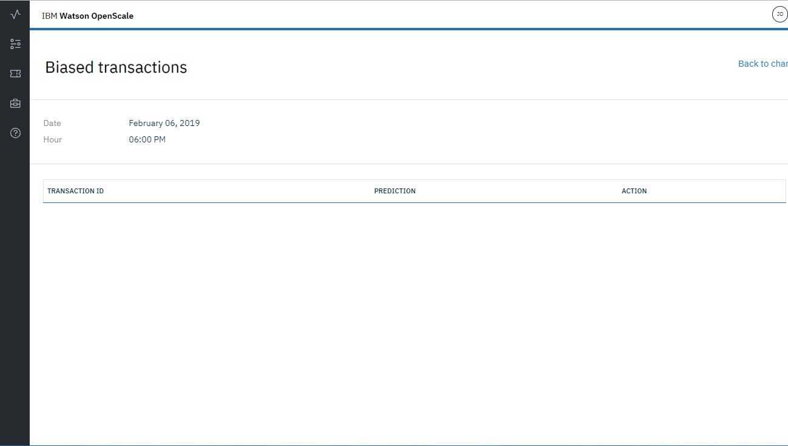

---

copyright:
  years: 2018, 2019
lastupdated: "2019-03-04"

---

{:shortdesc: .shortdesc}
{:new_window: target="_blank"}
{:hide-dashboard: .hide-dashboard}
{:tip: .tip}
{:important: .important}
{:note: .note}
{:pre: .pre}
{:codeblock: .codeblock}
{:screen: .screen}
{:javascript: .ph data-hd-programlang='javascript'}
{:java: .ph data-hd-programlang='java'}
{:python: .ph data-hd-programlang='python'}
{:swift: .ph data-hd-programlang='swift'}

# Getting started
{: #gs-get-started}

{{site.data.keyword.aios_full}} allows enterprises to automate and operationalize AI lifecycle in business applications, ensuring AI models are free from bias, can be easily explained and understood by business users, and are auditable in business transactions. {{site.data.keyword.aios_short}} supports AI models built and run in the tools and model serve frameworks of your choice.
{: shortdesc}

## Overview
{: #gs-demo}

Get a quick overview of {{site.data.keyword.aios_short}} by watching this video.

<p>
  <div class="embed-responsive embed-responsive-16by9">
    <iframe class="embed-responsive-item" id="youtubeplayer" title="Trust and Transparency in AI" type="text/html" width="640" height="390" src="https://www.youtube.com/embed/6Ei8rPVtCf8" frameborder="0" webkitallowfullscreen mozallowfullscreen allowfullscreen> </iframe>
  </div>
</p>

## Automated setup
{: #gs-module}

To quickly see how {{site.data.keyword.aios_short}} monitors a model, technical users can install a Python module that automates the configuration of {{site.data.keyword.aios_short}} and other services. Sample data is included.

Additional tutorial links may be found in the [Additional resources](/docs/services/ai-openscale-icp?topic=ai-openscale-icp-arsc-ov) topic.

## Before you begin
{: #gs-prereqs}

1.  [Install {{site.data.keyword.aios_short}} into {{site.data.keyword.icpfull}} for Data](/docs/services/ai-openscale-icp?topic=ai-openscale-icp-inst-install-icp).
1.  [Install any release of Python 3 ](https://www.python.org/downloads/){: new_window}.

    Python 3 includes the required pip package management system.
    {: note}

1.  Install the `ibm-ai-openscale-cli` package by running the following command:

    ```bash
    pip install -U ibm-ai-openscale-cli
    ```
    {: codeblock}

## Running the module
{: #gs-run}

Run the command with the following required arguments, substituting the necessary information as indicated:

```bash
ibm-ai-openscale-cli --apikey None --db2 <path to IBM DB2 credentials file> --env icp --username <admin> --password <password> --url https://<IP address of host ICP for Data installation>:31843
```
{: codeblock}

Regarding the optional `--datamart-name <datamart name>` argument, when you run the module, it creates a `datamart-name` value called `aiosfastpath`, which is a schema that must be reserved exclusively for use by {{site.data.keyword.aios_short}}. If you rerun the module, it programmatically deletes and recreates the `datamart-name` schema, so you can't use the schema for any other purpose.
{: note}

To successfully run the module, the value of the two Db2 database configuration parameters `SORTHEAP` and `LOGFILSIZ` must be increased. Run the following commands from your Db2 database environment command window:

```bash
db2 connect to [dbname] user [db username] using [db password]
```

```bash
db2 update db cfg for [dbname] using SORTHEAP 1024
```

```bash
db2 update db cfg for [dbname] using LOGFILSIZ 5000
```
{: important}

### Example of IBM DB2 credentials file

Your IBM DB2 credentials file might look something like the following `db2-vcap.json` file:

```bash
{
  "db_type": "db2",
  "hostname": "<DB2 IP address>",
  "password": "<your password>",
  "port": 50000,
  "db": "FASTPATH",
  "username": "<DB2 user name>",
  "url": "<Address to of DB2 on your system>"
}
```
{: codeblock}

## Viewing results in {{site.data.keyword.aios_short}}
{: #gs-open}

To view insights into the fairness and accuracy of the model, details of data that is monitored, and explainability for an individual transaction, open the {{site.data.keyword.aios_short}} dashboard.

### View insights
{: #gs-insights}

From the {{site.data.keyword.aios_short}} dashboard click the **Insights** tab, which shows an overview of metrics for deployed models: 

- At a glance, the Insights page shows any issues with fairness and accuracy, as determined by the thresholds that are configured.

- Each deployment is shown as a tile. The module configured a deployment called `GermanCreditRiskModel`, as shown in the following screen capture:

  

### View monitoring data
{: #gs-monitoring}

1.  From the Insights page, click the `GermanCreditRiskModel` tile to view details about the monitored data.
1.  Click and drag the marker across the chart to view a day and time period that shows data and then click the **View details** link. Alternatively, you can click different time periods in the chart to change the data that you see.

     - For example, the following screen shows data for a specific date and time. The dates and times vary, depending on when you run the module.

     - For information about interpreting the time series chart, see [Monitoring Fairness, Average Requests per Minute, and Accuracy](/docs/services/ai-openscale-icp?topic=ai-openscale-icp-itc-timechart).

      

1.  To see details about `AGE` data monitoring, ensure that `AGE` is selected from the drop-down menu.

    - Notice that in the following screen capture, no bias exists.

    - For information about interpreting the chart of the data points at a specific hour, see [Data visualization](/docs/services/ai-openscale-icp?topic=ai-openscale-icp-itc-timechart#itc-data-visual).

      

### View explainability
{: #gs-explain}

To understand the factors that contribute when bias is present for a given time period, from the visualization screen shown in the previous section, select the **View biased transactions** button.

Transaction IDs for the past hour are listed for those transactions that have bias. For the model used in this module, no bias exists for requests that are available. Therefore, no transactions are shown for the time period in the following screen capture.

  

For information about finding and explaining transactions, see [Monitoring explainability](/docs/services/ai-openscale-icp?topic=ai-openscale-icp-ie-ov).

## Related information
{: #gs-info}

- To learn about biases, see [Fairness](/docs/services/ai-openscale-icp?topic=ai-openscale-icp-mf-monitor).
- To learn about how well your model predicts outcomes, see [Accuracy](/docs/services/ai-openscale-icp?topic=ai-openscale-icp-acc-monitor).
- To learn about interpreting charts, data, and transactions, see [Monitoring Fairness, Average Requests per Minute, and Accuracy](/docs/services/ai-openscale-icp?topic=ai-openscale-icp-itc-timechart).
