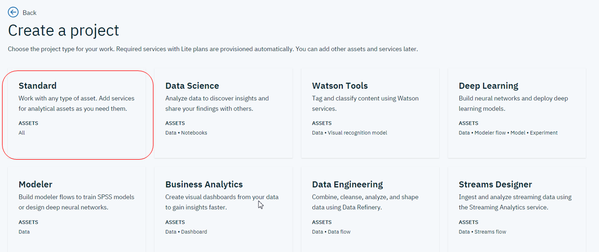
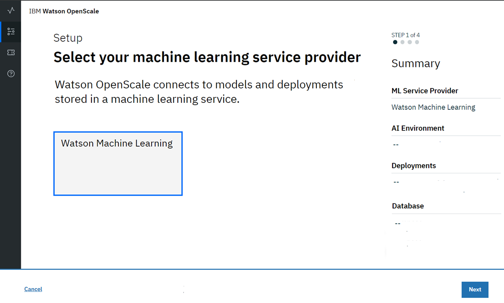
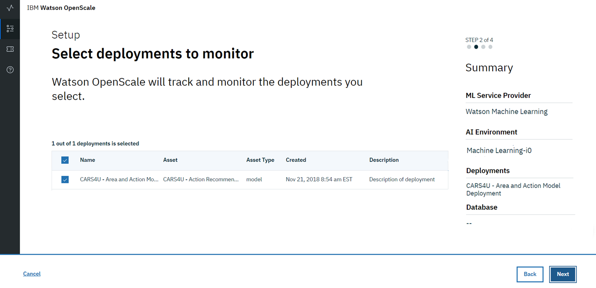
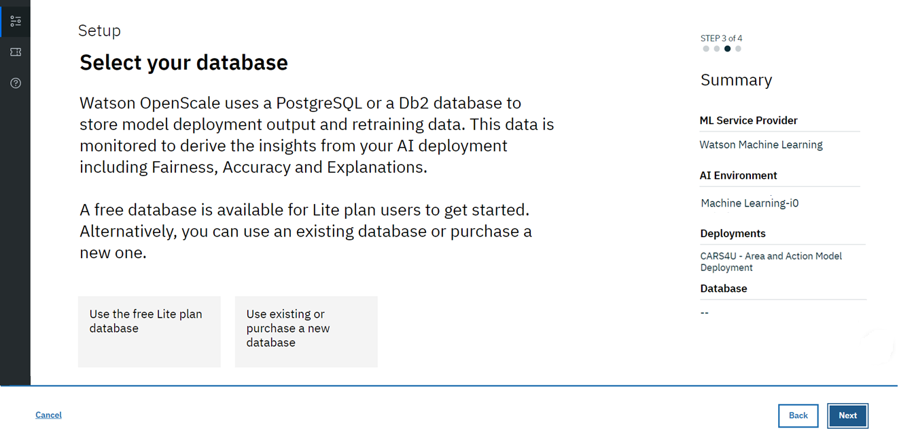
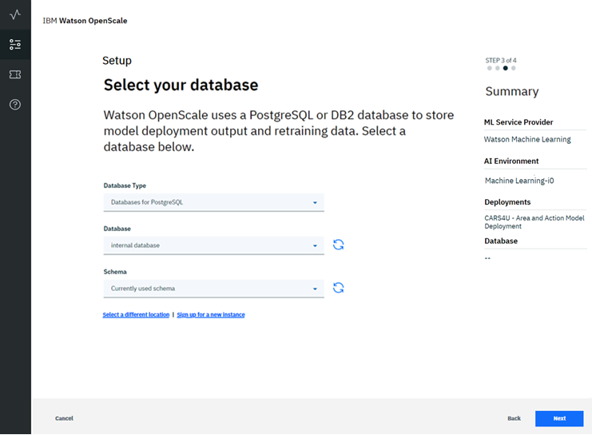
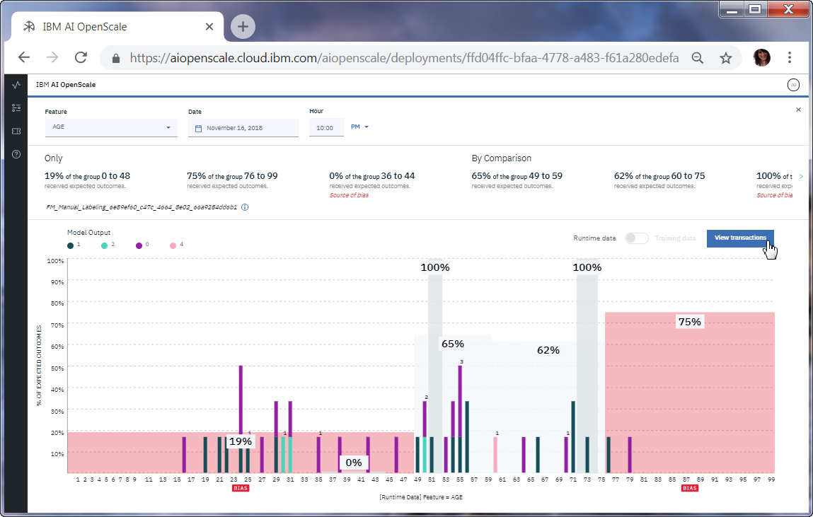
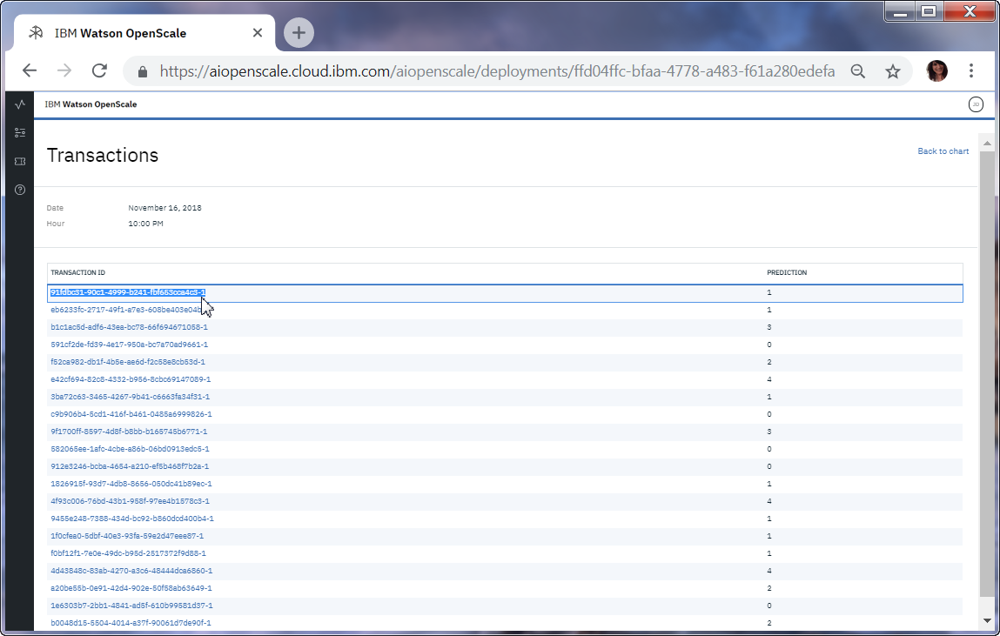
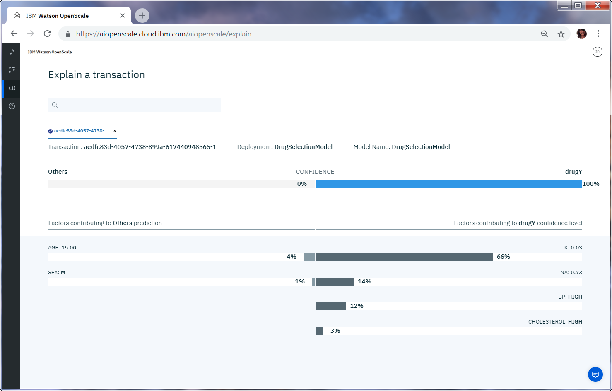

---

title: Trust and transparency for your machine learning models with AI OpenScale
description: Monitor your machine learning deployments for bias, accuracy, and explainability
duration: 120
intro: In this tutorial, you will provision IBM Cloud machine learning and data services, create and deploy machine learning models in Watson studio, and configure the new IBM AI OpenScale product to monitor your models for trust and transparency.
takeaways:
- See how AI OpenScale provides trust and transparency for AI models
- Understand how IBM Cloud services and Watson Studio technologies can provide a seamless, AI-driven customer experience

copyright:
  years: 2018
lastupdated: "2018-12-13"

---

{:shortdesc: .shortdesc}
{:new_window: target="_blank"}
{:hide-dashboard: .hide-dashboard}
{:tip: .tip}
{:important: .important}
{:note: .note}
{:pre: .pre}
{:codeblock: .codeblock}
{:screen: .screen}
{:javascript: .ph data-hd-programlang='javascript'}
{:java: .ph data-hd-programlang='java'}
{:python: .ph data-hd-programlang='python'}
{:swift: .ph data-hd-programlang='swift'}

# Getting started
{: #gettingstarted}

{{site.data.keyword.aios_full}} allows enterprises to automate and operationalize AI lifecycle in business applications, ensuring AI models are free from bias, can be easily explained and understood by business users, and are auditable in business transactions. {{site.data.keyword.aios_short}} supports AI models built and run in the tools and model serve frameworks of your choice.
{: shortdesc}

## Overview
{: #gs-view-demo}

Get a quick overview of {{site.data.keyword.aios_short}} by watching this video.

  

    <iframe class="embed-responsive-item" id="youtubeplayer" title="Trust and Transparency in AI" type="text/html" width="640" height="390" src="https://www.youtube.com/embed/6Ei8rPVtCf8" frameborder="0" webkitallowfullscreen mozallowfullscreen allowfullscreen> </iframe>
  

## Use case and the value of {{site.data.keyword.aios_short}}

A biomedical company that produces heart drugs has collected data about a set of patients, all of whom suffered from the same illness. During their course of treatment, each patient responded to one of four medications. The company is using this data to build an AI assistant for medical practitioners, which will recommend the drug it believes to be the best choice for the patient.

The model uses patient data fields AGE, SEX, BP (blood pressure), CHOLESTEROL, K (potassium levels), and NA (sodium levels) to predict one of four values for the DRUG data field.

  

### How {{site.data.keyword.aios_short}} can help

- *Identify run-time bias in the model*: The company has established evidence that shows the key factors that should influence which drug is predicted are BP, CHOLESTEROL, K and NA. AGE and SEX do play a role, but they're not as significant when compared to the other indicators. The company suspects that the data coming from patient trials might have suffered from biases of the practitioners for prescribing medications based on SEX and BP. The company wants to constantly monitor for such biases being learned from the data, and flag a suspected bias.

- *Constantly validate the accuracy of the model*: The company routinely evaluates the model prediction by having experts provide their own drug recommendations based on the patient data. The goal is to integrate these manual evaluations as feedback, to tell the model in real time where it might be wrong, and improve it over time.

- *Make the model more trustworthy*: To achieve a successful adoption of its AI assistant, the company received feedback from its customer base of medical practitioners and doctors who said they would not trust the AI model recommendations without understanding the logic behind them.

Each of these issues will be addressed in this tutorial, through the use of {{site.data.keyword.aios_short}}:

- The Fairness monitor will flag SEX and BP biases the model may have
- The Accuracy monitor uses feedback generated by your experts to test the performance of the deployed model, to detect model drift

## Alternate setup option
{: #module}

Instead of completing the following tutorial to explore {{site.data.keyword.aios_short}}, technical users can install a Python module that automates the configuration of {{site.data.keyword.aios_short}}. This module requires that Python 3 is installed, which includes the pip package management system. For instructions, see, [Installing a Python module to set up {{site.data.keyword.aios_short}}](/docs/services/ai-openscale/alt-setup.html).

## Tutorial objectives

In this tutorial, you will:

- Provision {{site.data.keyword.cloud_notm}} Watson Studio and IBM Cloud Object Storage services
- Set up a Watson Studio project on {{site.data.keyword.cloud_notm}}, and create, train, and deploy a machine learning model
- Configure and explore trust, transparency, and explainability for your model

## Before you begin
{: #prereqs}

1. [Install {{site.data.keyword.aios_short}} into {{site.data.keyword.icpfull}} for Data](/docs/services/ai-openscale-icp/install-icp.html).
1. For each of the following services that you don't already have associated with your account, create an instance by clicking the link, giving the service a name, selecting the **Lite** (free) plan, and clicking the **Create** button:
  - [Watson Studio ](https://{DomainName}/catalog/services/watson-studio){: new_window}

    

  - [Object Storage ](https://{DomainName}/catalog/services/cloud-object-storage){: new_window}

    

## Set up a Watson Studio project

1. Log in to your [Watson Studio account ](https://dataplatform.ibm.com/){: new_window} and begin by creating a new project. Select "Create a project":

  

1. Select the **Standard** tile, to create the project:

  

1. Give your project a name and description, make sure the Object Storage service you created in the previous step is selected in the **Storage** menu, and click **Create**.

## Create and deploy a machine learning model

### Add the `CARS4U Action Recommendation - model` notebook to your Watson Studio project

1. Download the following file:

    - [CARS4U Action Recommendation - model](https://github.com/pmservice/ai-openscale-tutorials/blob/master/notebooks/CARS4U%20action%20recommendation%20-%20model.ipynb)

2. From the **Assets** tab in your Watson Studio project, click the **Add to project** button and select **Notebook** from the dropdown:

  

3. Select **From file**:

  

4. Then click the **Choose file** button, and select the "CARS4U Action Recommendation - model" that you downloaded:

  

5. In the **Select runtime** section, choose the Spark instance you created earlier from the dropdown list:

  

6. Click **Create Notebook**.

### Edit and run the `CARS4U Action Recommendation - model` Notebook

The `CARS4U Action Recommendation - model` notebook contains detailed instructions for each step in the Python code you will run. As you work through the notebook, spend some time to understand what each command is doing.
{: tip}

1. From the **Assets** tab in your Watson Studio project, click the **Edit** icon next to the `CARS4U Action Recommendation - model` notebook to edit it.

2. In section 2.2, "Upload data to PostgreSQL database", replace the Postgres service credentials with the ones you created in the previous section.

3. In section 4, "Store the model in the repository", under **TIP**, replace the Watson Machine Learning credentials with the ones you created in the previous section.

4. Once you have entered your credentials, your notebook is ready to run. Click the **Kernel** menu item, and select **Restart and Run All** from the menu:

  

  This will create, train, and deploy the **CARS4U - Action Recommendation Model** in your project. You can verify that the model has deployed by selecting the **Deployments** tab of your Watson Studio project, and clicking the **CARS4U - Area and Action Model Deployment** link.

## Connect {{site.data.keyword.aios_short}} to your machine learning model

Since the machine learning model has been deployed, you can configure {{site.data.keyword.aios_short}} to ensure trust and transparency with your models. Select the **Manage** tab of your {{site.data.keyword.aios_short}} instance, and click the **Launch application** button. The {{site.data.keyword.aios_full}} Getting Started page opens; click **Begin**.

- Select the "Watson Machine Learning" tile and click **Next**.

  

- Select your Watson Machine Learning instance from the drop-down, and click **Next**.

  

- You are now able to select which deployed models will be monitored by {{site.data.keyword.aios_short}}. Check the model you created and deployed; click **Next** to accept this:

  

- Next, you need to choose a PostgreSQL database. You have two options: the free Lite plan database or an existing or new database. For this tutorial, select the **Use existing or purchase a new database** tile.

    

  **NOTE**: See more complete details about each of these options in the [Specify your database](/docs/services/ai-openscale/connect-db.html) topic.

- Once you have selected the "Use existing or purchase new database" option, {{site.data.keyword.aios_short}} checks your {{site.data.keyword.Bluemix_notm}} account to locate your existing Compose for PostgreSQL database.

  Select the "data_mart" schema from the **Schema** drop-down menu.

  

- Once you have selected the database and schema, click **Next** to review the summary data and click **Save**.

  

  Click **Exit to Dashboard** when prompted.

## Create a data mart and configure performance, accuracy, and fairness monitors

### Add the `Data Mart configuration and usage - CARS4U` notebook to your Watson Studio project

The `Data Mart configuration and usage - CARS4U` notebook contains detailed instructions for each step in the python code you will run. As you work through the notebook, spend some time to understand what each command is doing.
{: tip}

- Download the following file:

    - [Data Mart configuration and usage - CARS4U](https://github.com/pmservice/ai-openscale-tutorials/blob/master/notebooks/Data%20Mart%20configuration%20and%20usage%20-%20CARS4U.ipynb)

- From the **Assets** tab in your Watson Studio project, click the **Add to project** button and select **Notebook** from the dropdown:

  

- Select **From file**:

  

- Then click the **Choose file** button, and select the "Data Mart configuration and usage - CARS4U" that you downloaded:

  

- In the **Select runtime** section, choose the Spark instance you created earlier from the dropdown list:

  

- Click **Create Notebook**.

### Edit and run the `Data Mart configuration and usage - CARS4U` Notebook

- From the **Assets** tab in your Watson Studio project, click the **Edit** icon next to the `Data Mart configuration and usage - CARS4U` notebook to edit it.

- In section 1.1, "Installation and authentication":

    - Under **ACTION: Get instance_id (GUID) and apikey**, follow the instructions to get your credentials. Replace the `aios_credentials` with your own.

    - Next, in **ACTION: Add your Watson Machine Learning credentials here**, replace the Watson Machine Learning credentials with the ones you created previously.

    - Finally, under **ACTION: Add your PostgreSQL credentials here**, replace the Postgres credentials with the ones you created previously.

- Once you have entered your credentials, your notebook is ready to run. Click the **Kernel** menu item, and select **Restart and Run All** from the menu:

  

  This will set up your data mart, enable payload logging, configure and score performance, accuracy, and fairness monitors, and provide those metrics to your {{site.data.keyword.aios_short}} instance.

## Viewing results in {{site.data.keyword.aios_short}}
{: #open}

To view insights into the fairness and accuracy of the model, details of data that is monitored, and explainability for an individual transaction, open the {{site.data.keyword.aios_short}} dashboard.

### View insights
{: #insights}

From the {{site.data.keyword.aios_short}} dashboard click the **Insights** tab, which shows an overview of metrics for deployed models: 

- At a glance, the Insights page shows any issues with fairness and accuracy, as determined by the thresholds that are configured.

- Each deployment is shown as a tile. The module configured a deployment called `DrugSelectionModel`, as shown in the following screen capture:

  

### View monitoring data
{: #monitoring}

1.  From the Insights page, click the `DrugSelectionModel` tile to view details about the monitored data.
1.  Slide the marker across the chart to view a day and time period that show data and then click the **View details** link.

     - For example, the following screen shows data for a specific date and time. The dates and times vary, depending on when you run the module.

     - For information about interpreting the time series chart, see [Working with monitored data > Monitoring Fairness, Average Requests per Minute, and Accuracy](/docs/services/ai-openscale-icp/insight-timechart.html#insight-time-chart).

      

1.  From the **Feature** menu, ensure that `AGE` is selected to see details about  `AGE` data monitoring.

    - Notice that in the following screen capture, the source of the bias is for the age group `36 to 44`.

    - The next section describes how to view the factors that contribute to bias.

    - For information about interpreting the visualization of the data points at a specifc hour, see [Working with monitored data > Data visualization](/docs/services/ai-openscale-icp/insight-timechart.html#insight-data-visual).

      

### View explainability
{: #explain}

1.  To understand the factors that contribute when bias is present for a given time period, from the visualization screen shown in the previous section, select the **View transactions** button.

    Transaction IDs for the past hour are listed.

1.  Copy one of the transaction IDs.

    

1.  Click the **Explainability** tab: 

    The "Explain a transaction" page is shown.

1.  Paste the copied transaction ID into the search box and press the Enter key on your keyboard.

    - The page shows how the model arrived at its conclusion, including how confident the model is, the factors that contribute to the confidence level, and the attributes that were fed to the model.

    - For information about interpreting transaction explainability, see [Working with monitored data > Monitoring Explainability](/docs/services/ai-openscale-icp/insight-timechart.html#insight-explain).

      

## Related information
{: #info}

- To learn about biases, see [Fairness](/docs/services/ai-openscale-icp/monitor-fairness.html).
- To learn about how well your model predicts outcomes, see [Accuracy](/docs/services/ai-openscale-icp/monitor-accuracy.html).
- To learn about interpreting charts, data, and transactions, see [Working with monitored data](/docs/services/ai-openscale-icp/insight-timechart.html).
