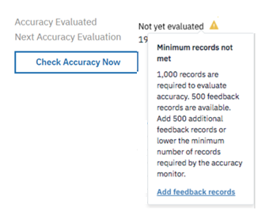
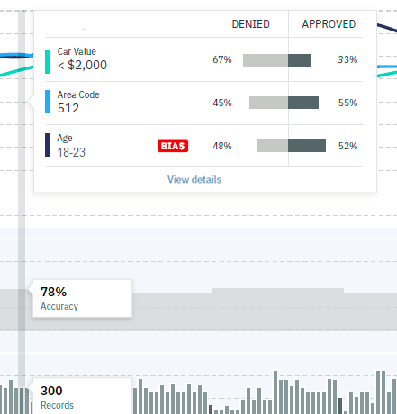
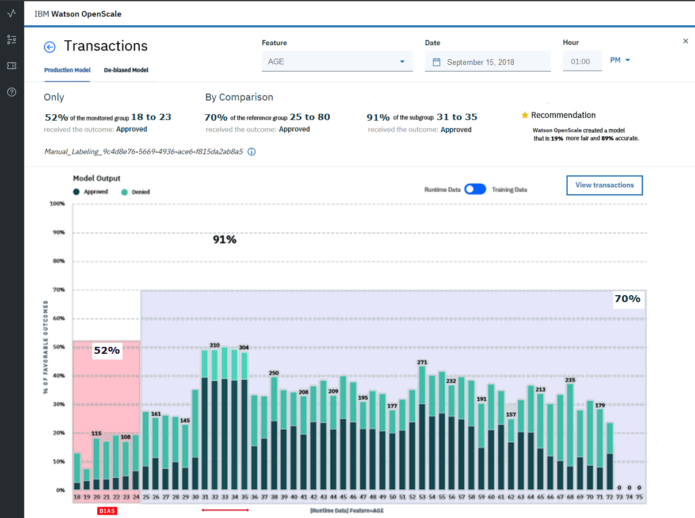
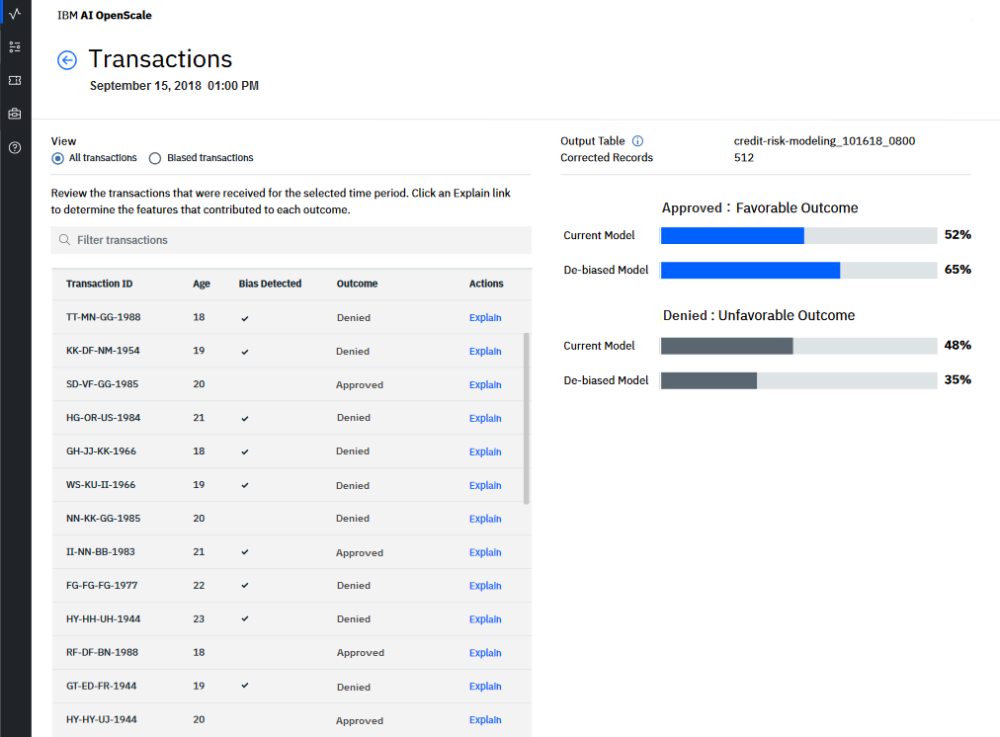
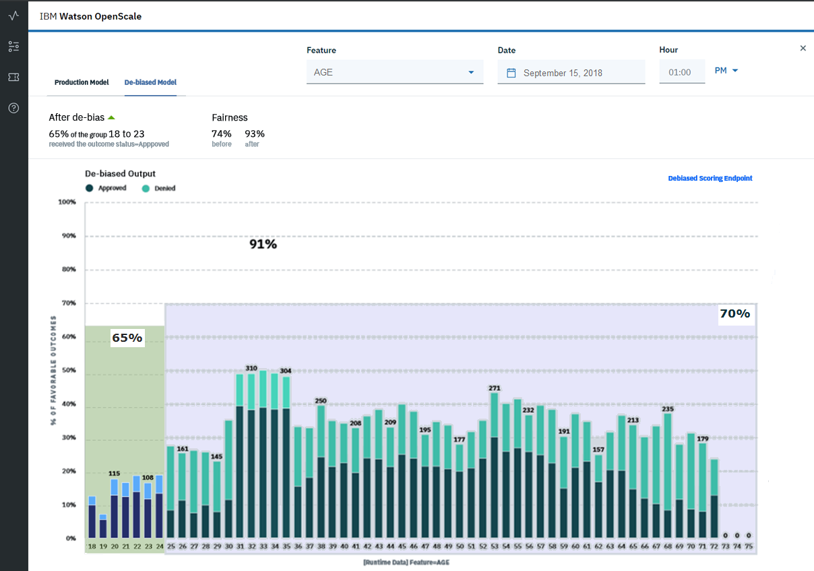
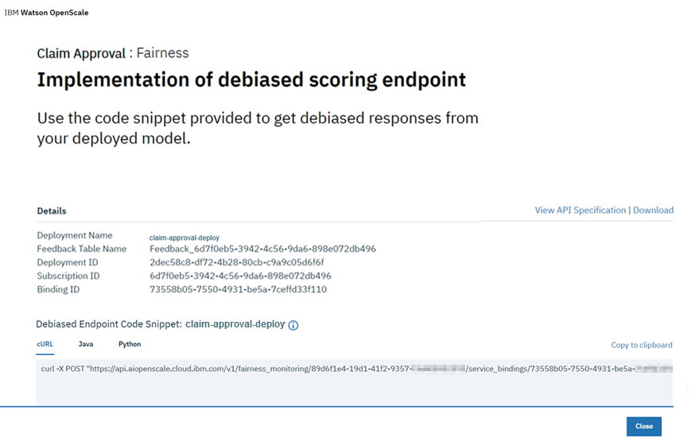

---

copyright:
  years: 2018, 2019
lastupdated: "2019-03-07"

---

{:shortdesc: .shortdesc}
{:new_window: target="_blank"}
{:tip: .tip}
{:important: .important}
{:note: .note}
{:pre: .pre}
{:codeblock: .codeblock}
{:screen: .screen}

# Monitoring Fairness, Average Requests per Minute, and Accuracy
{: #itc-timechart}

Monitoring data for individual deployments are displayed in a time series chart. The chart tracks Fairness, Average Requests per Minute, and Accuracy over the last seven days.
{: shortdesc}

## Viewing data for a deployment
{: #itc-view}

Select a deployment from the dashboard to see monitoring data for that deployment. The top of the monitoring data chart displays information about the deployed model, including when the model was last evaluated for Fairness and Accuracy, and when it will be evaluated next.

Because the algorithm checks are only run every hour, there are also buttons provided to allow you to check Fairness and Accuracy on-demand. If you have not provided enough payload records (Fairness) or feedback records (Accuracy), you will see the following message, for example:

Next, move the marker across the chart to see statistics for an individual hour. In this example, the time selected is 1:00 PM CST on September 18, which reveals the following statistics:

  

- ***Fairness***: Two of three Fairness features, Car Value and Area Code, met their set thresholds for approval. The third Fairness feature, Age, was flagged for bias. You can also see the number of expected outcomes (in this case percentages Approved vs. Denied) for an individual population in the features monitored for fairness.
- ***Accuracy***: The Accuracy metric averaged 78%.
- ***Avg. Reqs/Min***: On average, 300 records were processed per minute between 1:00 and 2:00 PM CST. The throughput is computed every minute, and its average value over the course of the hour is reported in the chart.

## Visualizing data for a specific hour
{: #itc-data-visual}

To see details behind a particular Fairness statistic, click the **View details** link for the selected hour.

A visualization opens of the data points for a monitored feature at the selected hour. Following the previous example the Age feature, which has been tagged for bias, is shown.

Note the three filters at the top of the page (Feature, Date, and Hour) that let you select a different feature or time to review details.

  

### Interpreting the chart
{: #itc-intp}

The chart shows multiple things:

- You can observe the population experiencing bias (customers between 18 and 23 years old). The chart also shows the percentage of expected outcome (52%) for this population.

- The chart shows the percentage of expected outcome (70%) for the reference population. This is the average of expected outcome across all reference populations.

- The chart is indicating the presence of bias, because the ratio of percentage of expected outcomes for populations age 18 to 23 years old to the percentage of expected outcomes for the reference population is below the threshold. In other words, 0.52/0.7 = 0.74, which is less than the 0.8 threshold.

- The chart also shows the distribution of the reference and monitored values for each distinct value of the attribute in the data from the payload table which was analyzed to identify bias. In other words, if the bias detection algorithm analyzed the last 1790 records from the payload table, then 120 of those records had customer age between 18 and 23, and out of that distribution the `Approved` and `Denied` outcomes are represented by the bar chart. The distribution of the payload data is shown for each distinct value of the fairness attribute (even reference values are shown). This information can be used to correlate the bias with the amount of data received by the model.

- The chart additionally shows that the population with ages between 31 and 35 years received 91% expected outcomes. This signifies the source of the bias, which means that data in this group skewed the results, and led to an increase in the percentage of expected outcomes for the reference class. This information can be used to identify parts of the data which can then be under-sampled when retraining the model.

- Another important thing that the chart shows is the name of the table containing the data which has been identified for manual labeling. Whenever the algorithm detects bias in a model, it also identifies the data points which can be sent for manual labeling by humans. This manually-labeled data can then be used along with the original training data to retrain the model. This retrained model is likely to not have the bias. The manual labeling table is present in the database associated with the {{site.data.keyword.aios_short}} instance.

## Runtime and Training Data
{: #itc-rtsw}

The Runtime data / Training data switch lets you toggle the differences between your trained model and the data collected at runtime that is triggering a bias warning.

## View transactions
{: #itc-tra}

This option allows you to view the individual transactions that contributed to bias when you click the **View transactions** button.

A list of transactions where the deployment has acted in a biased manner is listed. Click the **Explain** link for any of the transaction IDs to get details about that transaction in the Explainability tab. For more information, see [Monitoring explainability](/docs/services/ai-openscale-icp?topic=ai-openscale-icp-ie-ov).

Select the **All transactions** view to see all transactions from the selected feature (in this example "AGE"), and the selected period (in this example "September 15, 2018 1:00 PM"):

Select the **Biased transactions** view to see only the subset of transactions that received biased outcomes. Each biased transaction is compared to a similar-but-slightly-altered (perturbed) transaction that shows how changing the value of the monitored feature (AGE) will result in a favorable outcome for the biased transaction:

## Production model and De-biased model
{: #itc-prdb}

You can use these two tabs to toggle between your production model, and a de-biased model created by {{site.data.keyword.aios_short}}. See [Understanding how de-biasing works](/docs/services/ai-openscale?topic=ai-openscale-mf-monitor#mf-debias) for more details.

Selecting the **De-biased model** tab will show you the changes in the de-biased model, versus the model in production. In this example, the model Fairness has increased from 74% to 93%, with a drop of only 1% in Accuracy. The chart also reflects the improved outcome status for groups aged 18 to 23.

### De-biasing options
{: #itc-dbo}

- *Passive de-biasing* - When {{site.data.keyword.aios_short}} does bias checking, it also does a de-biasing of the data, by analyzing the behavior of the model, and identifying the data where the model is acting in a biased manner.

  {{site.data.keyword.aios_short}} then builds a machine learning model to predict whether the model is likely to act in a biased manner on a given, new data point. {{site.data.keyword.aios_short}} then analyzes the data which is received by the model, on an hourly basis, and finds the data points where {{site.data.keyword.aios_short}} believes the model is acting in a biased manner. For such data points, the fairness attribute is perturbed from minority to majority, and the perturbed data is sent to the original model for prediction. This prediction of the original model is used as the de-biased output.

  {{site.data.keyword.aios_short}} performs this de-biasing hourly, on all the data which has been received by the model in the past hour. It also computes the fairness for the de-biased output, and displays it in the **De-biased model** tab.

- *Active de-biasing* - In active de-biasing, you can make use of a de-biasing REST API endpoint from your application. This REST API endpoint will internally call your model, and check its behavior.

  If {{site.data.keyword.aios_short}} believes that the model is acting in a biased manner, it will do the data perturbation as mentioned above, and send it back to the original model. The output of the original model on the perturbed data will be returned as the de-biased prediction. If {{site.data.keyword.aios_short}} determines that the original model is not acting in a biased manner, then {{site.data.keyword.aios_short}} will return the original model's prediction as the de-biased prediction. Thus, by using this REST API endpoint, you can ensure that your application does not make decisions based on biased output of your models.

  Select the **Debiased Scoring Endpoint** link to find your de-biasing REST API endpoint

  
